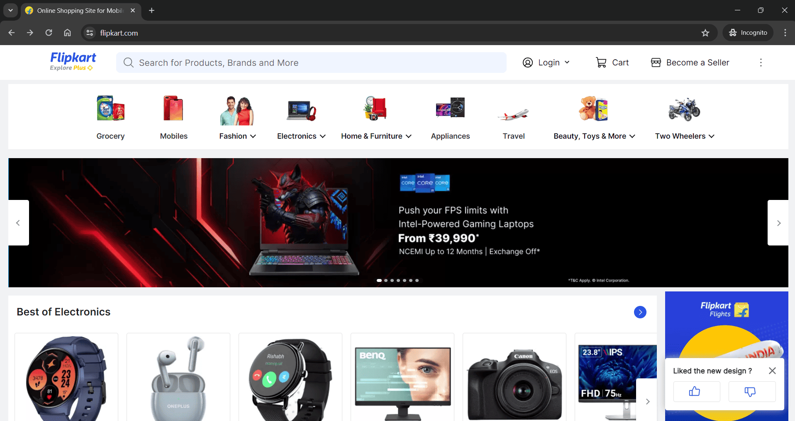

# Flipkart Automation

`Selenium` `Xpath` `TestNG`

---

This project involves automating the Flipkart e-commerce website and operating on the number of likes, reviews, etc and printing relevant item-details.

---

# Overview
This project involves automating the Flipkart e-commerce website and operating on the number of likes, reviews, etc and printing relevant item-details.

# Automating Flipkart
## Scope of work
* Automated the following Test Cases:
    * Went to [flipkart.com](https://www.flipkart.com). Searched for "Washing Machine". Sorted by popularity and printed the count of items with rating less than or equal to 4 stars.
    * Searched "iPhone", printed the Titles and discount % of items with more than 17% discount.
    * Searched "Coffee Mug", selected 4 stars and above, and printed the Title and image URL of the 5 items with highest number of reviews.

## Skills used
`Selenium` `Xpath` `TestNG`

---

# Prerequisites
1. Java 21
2. Gradle 7.5.1
3. VS Code 1.89.1

# Installation Instructions
Clear steps to set up and run the project locally.
1. Make clone of this repo
2. Open in VS code IDE
3. Build using `./gradlew build` command
4. Run test using `./gradlew test` command

# Important Links:

1. [Flipkart](https://www.flipkart.com)
2. [Test Cases](https://docs.google.com/spreadsheets/d/14AtYHcjHRRCa7hKSYgbidhab7NZreFx0lf8brptd5Ig/edit?usp=sharing)

# Screenshots

> Flipkart Web Application

> Gradle build

> Gradle test
